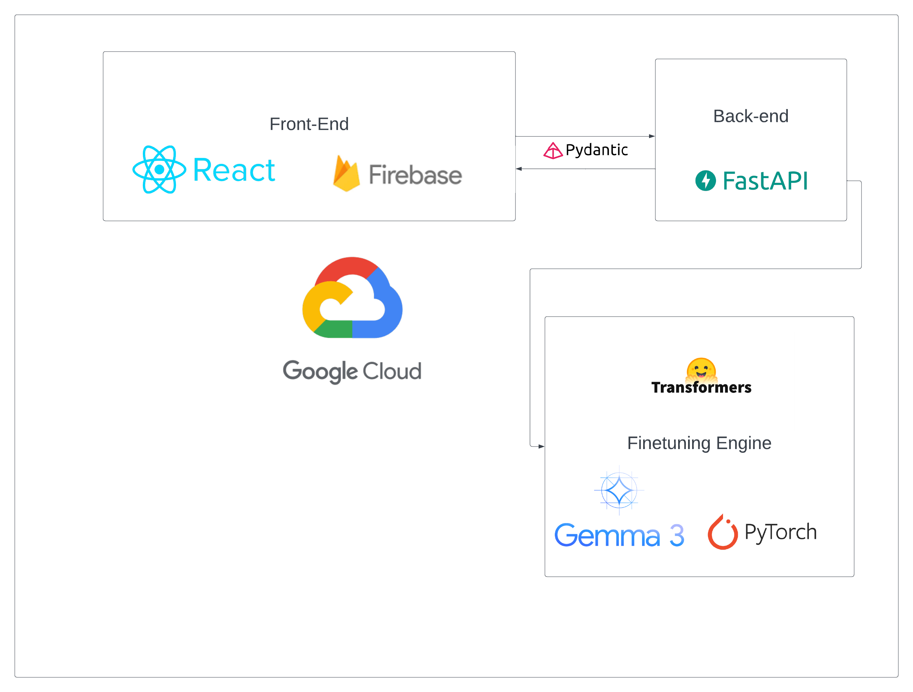

# Gemma LLM Garage 🚀

**Empowering anyone on the planet to fine-tune language models with just a dataset! 🌍**

**Live demo**: https://gemma-garage.web.app/

Now supporting the new **Gemma 3** family models!!!!

Gemma LLM Garage is an application that makes fine-tuning accessible to everyone. With just your dataset, you can:
- **Fine-tune models** 🤖
- **Monitor training loss in real time** 📈
- **Test your fine-tuned model through inference**

*Note: Due to cost limitations, all features are currently deployed on CPU, which may result in slower performance.*

---

## Features 🔧
- **Fine-Tuning:** Easily customize and improve models using your own dataset.
- **Real-Time Monitoring:** Visualize training progress with live loss graphs.
- **Inference Testing:** Run quick tests on your fine-tuned models.

---

## Architecture & Infrastructure 💻

- **Backend:**  
  - Developed with **FastAPI** 
  - Deployed using **Google Cloud Run**

- **Frontend:**  
  - Built with **React**
  - Hosted on **Firebase**



---

## Getting Started 🚀

1. **Clone the repository:**
   ```bash
   git clone https://github.com/your-username/llm-garage.git
   cd llm-garage
